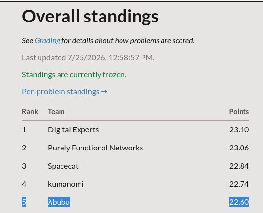
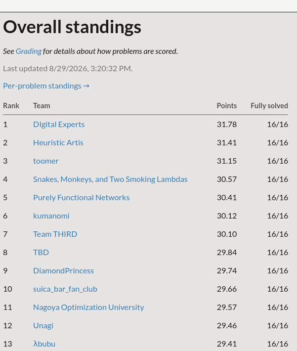

# ICFP 2026 — Team λbubu (13th)

## Abstract

I entered alone as team λbubu, using coding agents throughout the contest. At the first scoreboard freeze I was 5th of 201 with 22.60 points. I finished 13th of 269 with 29.4086/32 points, passing every test on all 16 graded problems.

[Official contest scoreboard](https://icfpcontest2026.com/standings)



*The frozen lightning-round standings: 5th place with 22.60 points.*



*Final standings: 13th place, 29.41 points, and all 16 problems fully solved.*

- Coding agents handled small and midsize rooms well, but struggled to connect them into complete layouts.
- Shared memory—the repository logs and Obsidian vault—and a manager agent coordinating workers enabled cooperation across fresh contexts.
- Small CLI tools were most useful when they covered steps the agents repeatedly struggled with.
- I overallocated time to `memory` based on predicted direct reuse; its implementation did not transfer, although its drum and delay-line techniques did.

## Contest and problem format

The contest had two stages: a 24-hour lightning round, followed by the remainder of the 72-hour contest. Under the [official rules](https://icfpcontest2026.com/rules), the live scoreboard was frozen from hours 22 to 26, then again from hour 70 onward, leaving the final result hidden until the ICFP conference.

Littleman programs are ASCII grids. Little men walk instructions inside rectangular rooms; rooms run concurrently and communicate through one-way pipes. A value moves one pipe cell per tick, so pipe length determines both latency and capacity. Send and receive instructions also select pipes by geometric distance, making placement part of the program's behavior.

Each problem awarded up to two contest points: one from the fraction of test cases passed and one from ranking against other eligible teams. For most problems, the lower-is-better program score was `max(width, height)² × average ticks`. Since the footprint used only the longest side of the bounding box, the grid had to be packed toward a square, with pipes snaking through the available corridors between rooms.

## First CLI tools

The first tool I added was the `icfp` CLI. It let coding agents fetch problems and public cases, inspect standings and submission results, and submit locally checked candidates without me relaying API calls. Other teams' scores showed where a small improvement could gain points and where the gap was too large.

`lm` began as a quick Python implementation of the machine and judge, which made uncertain semantics easy to correct. When grid search made it a bottleneck, I ported it to Rust as `lmr`, keeping the interface and checking parity against Python.

## End of the lightning round

When the first scoreboard freeze began, two hours before the lightning round ended, my visible rank was 5th. At the end of the round, the `Y` instruction was introduced.

I had been moving through tasks too sequentially and overinvested in `memory`, expecting its implementation to unlock harder tasks. The exact implementation saw little direct reuse, although its delay-line, drum, and geometry techniques did. The cost was attention: I had followed predicted reuse instead of the points and bottlenecks already visible.

After 24 hours, the agents' ideas were also plateauing, so I paused task work and examined the workflow.

## Giving agents tools where they struggled

Coding agents handled small and midsize rooms well; integrating them was disproportionately harder. Worse, an agent could route a complete program before discovering a basic bug inside one room. I needed a way to execute the actual rooms before investing in final placement and routing.

### Ephemeral pipes

The first fix was small enough to add directly to the Python `lm` runner. An agent could leave rooms disconnected and mark each outgoing end with a lowercase letter and its incoming end with the matching uppercase letter.

```text
           +------+
+-+        |>@rM+v|          +-+
|I|a      A|^.H.s<|c        C|O|
+-+        +------+          +-+
```

Here `a`/`A` and `c`/`C` describe two connections without drawing pipes. `lm test design.man --ephemeral-pipes` routed temporary legal pipes through the normal loader, letting room logic fail before final routing. It proved the logic, not the pack.

### Room variants and `lmp`

The next step was to make the same idea reusable. Room interfaces described pins, while an `.eman.toml` file described the netlist without committing to a concrete layout. The name stood for **ephemeral man**.

The minimum file layout looked like this:

```text
rooms/
├── input/ ...
├── output/ ...
└── doubler/
    ├── interface.toml
    ├── west-east.room
    └── north-south.room
programs/example/
└── design.eman.toml
cases.json
```

The `.room` files could not be simple rotations: every little man starts facing east, so rotating the grid does not rotate its execution. I generated separate wide, tall, and pin-layout variants, then let `lmp` choose from this room zoo.

`rooms/doubler/interface.toml` gave local marker letters stable port names:

```toml
description = "doubles each input"

[ports]
feed = "A"
out = "c"
```

Each `.room` file was one legal implementation of that interface. For example, `west-east.room` placed the incoming pin on the west wall and the outgoing pin on the east wall:

```text
 +------+
A|>@rM+v|c
 |^.H.s<|
 +------+
```

The netlist instantiated room types and connected ports without fixing their positions:

```toml
problem = "<slug>"

[rooms]
input = "input"
double = "doubler"
output = "output"

[[pipes]]
from = "input.out"
to = "double.feed"
min = 2

[[pipes]]
from = "double.out"
to = "output.feed"
min = 2
```

The `min` field was semantic: pipes often served as buffers, delay lines, or drum memory. `--logic-check` rejected a nonplanar room graph, composed the first variants at their declared minimum lengths, and checked bindings and cases without drawing a `.man` or proving concrete packability.

`--check` found and ran one concrete routable placement. The packing search then moved rooms, changed variants, and rerouted, primarily minimizing `max(width, height)` with routed pipe cells as a tiebreaker. Ticks were reported but not optimized.

The same files supported a quick concrete check and a longer packing search:

```sh
lmp programs/example/design.eman.toml -c cases.json --logic-check
lmp programs/example/design.eman.toml -c cases.json --check
lmp programs/example/design.eman.toml -c cases.json --seconds 60 --keep 3
```

This became the preferred late-contest deliverable: tested rooms and a netlist instead of a hand-routed `.man`. Earlier generators stayed when conversion was unlikely to repay the contest time.

## The working loop

The loop joined shared memory, a manager agent, workers, and executable evaluation:

1. The manager read the specification, task log, baseline, and standings, then assigned one hypothesis.
2. A worker made the smallest room or netlist change that tested it.
3. `lmp` checked logic, concrete routing, and packing.
4. `lmr` stress-tested promising packs before submission.
5. The manager recorded the result and decided whether to continue or switch tasks.

While awake, I used one manager and five workers. While sleeping, I assigned independent tasks in parallel. Repository logs and the Obsidian vault carried measurements, failures, and current baselines between contexts.


*The Obsidian vault at the end of the contest.*

## Limits

### Shared memory

I generally like “second brain” systems such as Zettelkasten and PARA. Their greatest value for me is not storage: they bring relevant context together and provide a space where the human brain can generate more ideas. They work best when I remain an active participant in writing, linking, and revisiting the notes; the system is part of the thinking process, not only a store of context or a way to outsource the thinking to an LLM.

During this contest, too much of the vault was AI-written. The facts remained searchable, but I became detached from their relationships, which made it harder to notice tensions and form new hypotheses. Next time I would keep writing and curation human-led, with agents assisting rather than owning the memory.

### The `little-little-man` exception

`little-little-man` was the only task where the general workflow never converged. It required a Littleman interpreter with multiple rooms and pipes. The coding agents repeatedly tried to avoid the general interpreter with public-case replay and similar shortcuts; one replay solution passed 14/14 public cases and 0/14 private cases.

For roughly the last six hours, I stopped treating it like the other tasks and worked directly with Claude Opus 5. The process followed partial results and intuition more than clean, testable hypotheses. The final solution was one very large room, with Python generating repeated blocks inside it.

I was dissatisfied with the architecture. It is monolithic, difficult to inspect, and unlike the modular room-and-packer workflow used elsewhere. It solved the task, but the process relied more on intuition than on the measured loop above. “Pure vibes” is still the most honest shorthand for those last hours.

Under the pressure and thrill of a deadline, stopping can feel harder than continuing. My note to myself is that this may be exactly when a hard stop and a restart from first principles are most useful, even with only hours left. Learning to recognize and take that pause is another area where I want to improve.

## Thanks

Thank you to the organizers for the challenging and unusual tasks, and to the other teams for the pressure and thrill of the competition.

## Repository

- `py/`: prototypes, generators, the API client, and the Python runner.
- `rs/`: `lmr` and the `lmp` packer.
- `rooms/`: reusable room implementations and pin variants.
- `programs/`: netlists and packed candidates, including some server-verified submissions whose receipts are recorded in the task logs.
- `docs/`: specifications, research logs, and reusable findings.
